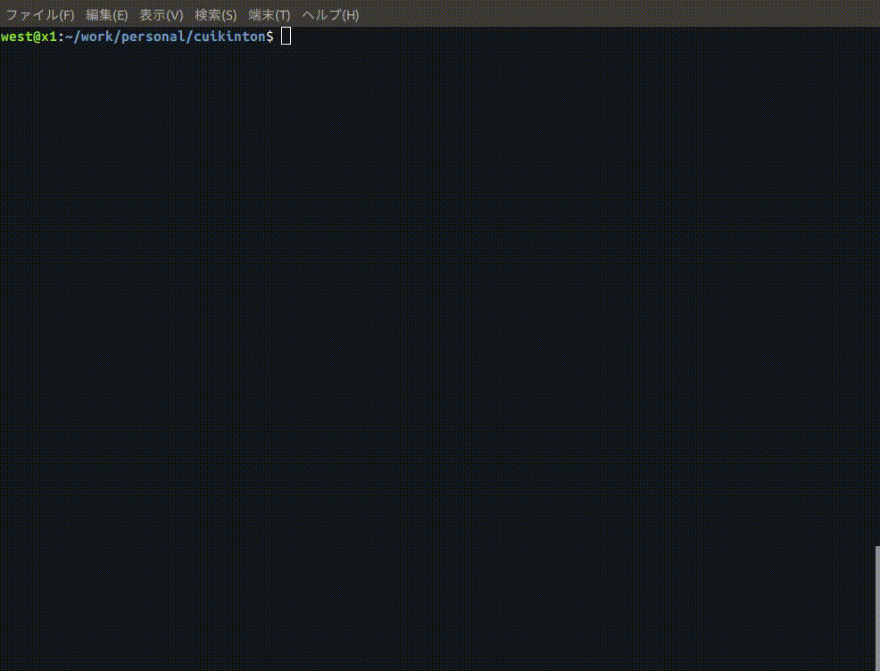

# cuikinton - A terminal interface for kintone

ターミナルから使う [kintone](https://kintone.cybozu.co.jp/) ビューアーです。  
そのまま読むと「くいきんとん」ですが、自分は通称「くりきんとん」と呼んでます。



# Features

* 指定のアプリに接続して、$idの降順で最大100件のレコードを取得します
* 取得したレコードの中身をJSONで表示します

アプリ開発中のレコードの中身をデバッグするのに便利かもしれません。
100件以上のレコードのページングなどは実装していませんので、必要であれば作ってプルリクエストをください。

# Requirement

手元では以下の環境でビルドしました。

* go version go1.14.4 linux/amd64

# Build

```bash
cd cmd/cuikinton/
go build
```

# Usage

ドメイン、ユーザー名、パスワード、APIトークンは環境変数の値をデフォルトとして読み込みます
（APIトークン以外は [plugin-uploader](https://developer.cybozu.io/hc/ja/articles/360000947326) と同じ環境変数名になっています）。

APIトークンが指定されていれば、ユーザー名が指定されていても無視します。

```bash
NAME:
   cuikinton - A terminal interface for kintone

USAGE:
   cuikinton [global options] command [command options] [arguments...]

VERSION:
   0.0.1

COMMANDS:
   help, h  Shows a list of commands or help for one command

GLOBAL OPTIONS:
   --domain value, -d value           your kintone domain [$KINTONE_DOMAIN]
   --user value, -u value             kintone user name [$KINTONE_USERNAME]
   --password value, -p value         kintone password [$KINTONE_PASSWORD]
   --apitoken value, -t value         kintone api token [$KINTONE_APITOKEN]
   --appid value, --aid value         appId to connection (default: 0)
   --guestspaceid value, --gid value  GuestSpaceID to connection (default: 0)
   --help, -h                         show help
   --version, -v                      print the version
```

## Key bind

* 上下キー : 内容のスクロール
* PageUp/PageDown : 内容のスクロール
* Tab : 表示領域の切り替え
* 左ペインでEnter : 選択されたレコードを表示
* Ctrl+C : アプリ終了

## Author

[Koichiro Nishijima](https://github.com/k-nishijima/)

## License

[MIT license](https://en.wikipedia.org/wiki/MIT_License)
